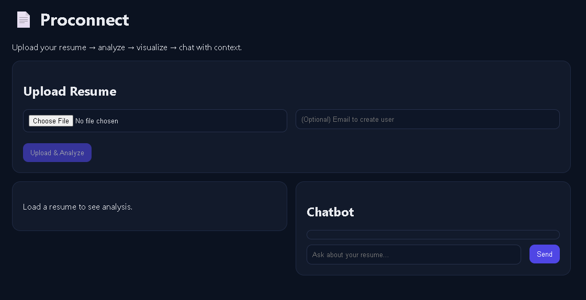
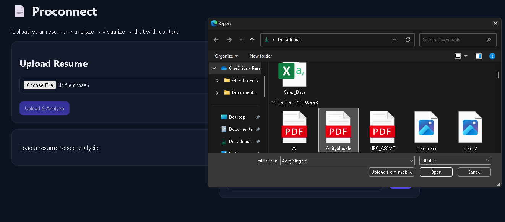
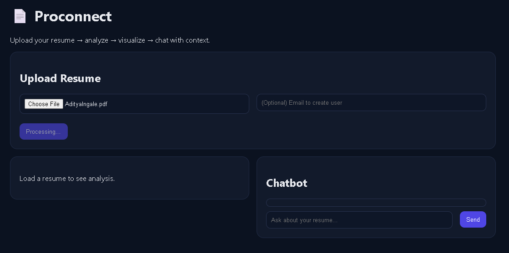
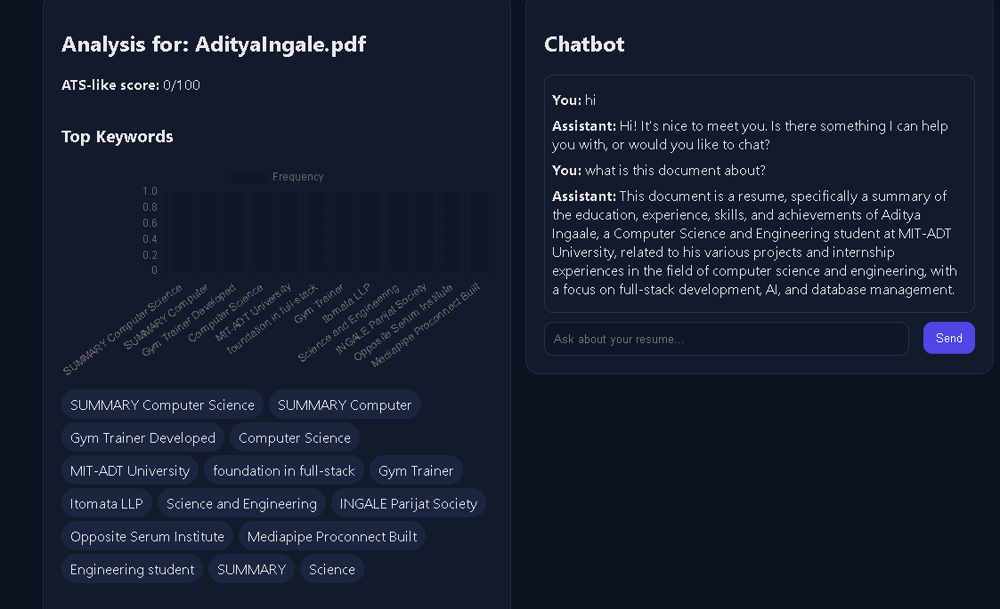
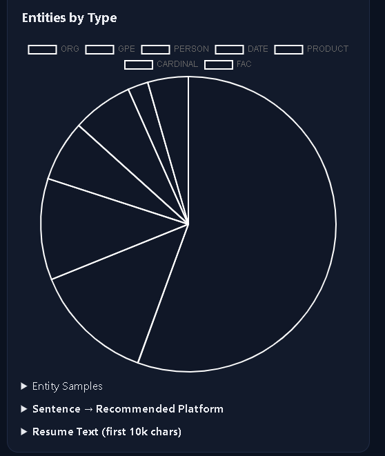
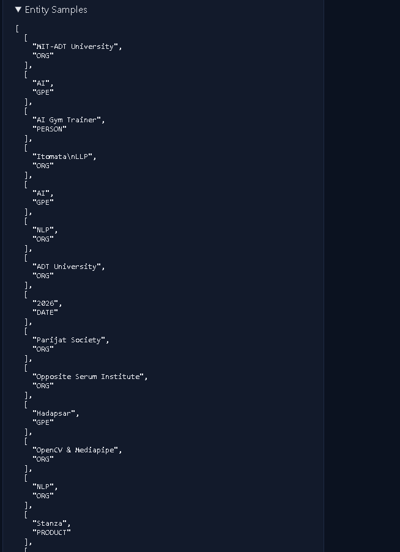
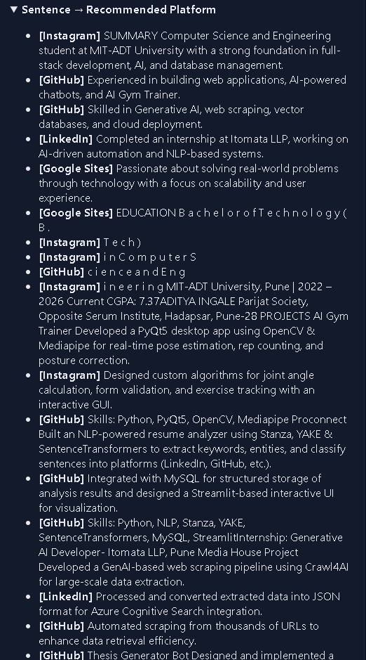
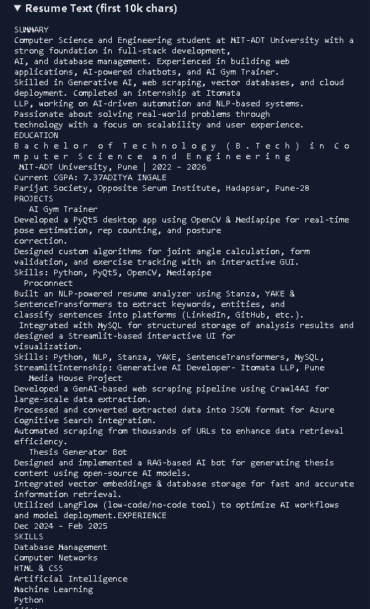
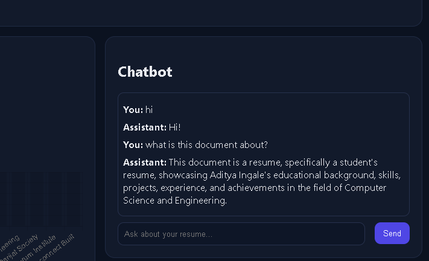

# Proconnect


Proconnect is a full-stack web app where users upload resumes for automated analysis and visualization. It features a context-aware chatbot to answer questions about the uploaded resumes, providing AI-driven insights and career guidance.

📄 **Proconnect**  
Upload your resume → analyze → visualize → chat with context.

---

## Table of Contents
- [Project Description](#project-description)
- [Features](#features)
- [Screenshots](#screenshots)
- [Tech Stack](#tech-stack)
- [Installation](#installation)
- [Usage](#usage)
- [Folder Structure](#folder-structure)
- [Requirements](#requirements)
- [License](#license)

---

## Project Description
Proconnect is a full-stack web application that allows users to:

- Upload resumes in PDF, DOCX, or TXT formats.
- Automatically analyze resume content to extract:
  - Keywords
  - Named entities
  - Important nouns
  - Resume scoring
- Visualize analysis results using charts for quick insights.
- Interact with a context-aware AI chatbot that can answer questions based on the uploaded resume.
- Optionally create user profiles via email to link multiple resumes.

The backend is powered by **FastAPI** for handling APIs, NLP processing, and database interaction. The frontend is built using **React** for an interactive user experience.

---

## Features
- **Resume Upload:** PDF, DOCX, TXT support.
- **Text Analysis:** Extract keywords, entities, nouns, and compute a resume score.
- **Data Visualization:** Charts to display insights for quick interpretation.
- **Context-Aware Chatbot:** Ask questions related to the uploaded resume.
- **User Management:** Optional email-based user creation to link resumes.
- **Full-Stack Architecture:** Modern React frontend with FastAPI backend.
- **Extensible:** Easy to add new analysis features or AI models.

---

## Screenshots

### 1. Starting the App


### 2. Upload Resume
  


### 3. Analysis Screenshots
  
  
  
  


### 4. Chatbot Interaction


---

## Tech Stack
**Frontend:**
- React.js
- Axios for API requests
- CSS/HTML for layout and styling

**Backend:**
- Python 3.10+
- FastAPI for API endpoints
- SQLAlchemy + PyMySQL for database handling
- dotenv for environment configuration
- Groq API for chatbot integration
- PyPDF2, python-docx for resume parsing
- NLP processing with custom extract_text_features

**Database:**
- MySQL

---

## Installation

1. **Clone the repository:**
```bash
git clone https://github.com/Adityai1411/Proconnect.git
cd Proconnect
Set up backend:
```
cd backend
python -m venv .venv
.venv\Scripts\activate    # Windows
# OR for Linux/Mac: source .venv/bin/activate
pip install -r requirements.txt

Configure environment variables:

Copy .env.example to .env and set your values:
```
DB_HOST=127.0.0.1
DB_PORT=3306
DB_NAME=resume_db
DB_USER=resume_user
DB_PASSWORD=your_password

CORS_ORIGINS=http://localhost:5173

GROQ_API_KEY=your_groq_api_key
GROQ_MODEL=llama3-8b-8192
```

Create the database (MySQL):
```
CREATE DATABASE resume_db;
CREATE USER 'resume_user'@'localhost' IDENTIFIED BY 'your_password';
GRANT ALL PRIVILEGES ON resume_db.* TO 'resume_user'@'localhost';
FLUSH PRIVILEGES;
```

Run the backend server:
```
uvicorn app.main:app --reload --host 127.0.0.1 --port 8000
```

Set up frontend:
```
cd ../frontend
npm install
npm run dev
```
Usage
```
Open your browser and go to http://localhost:5173.

Upload your resume in PDF, DOCX, or TXT format.

Click Upload & Analyze to get insights and visualizations.

Ask questions about your resume in the chatbot section.
```
Folder Structure
```
Proconnect/
│
├── backend/
│   ├── app/
│   │   ├── routers/
│   │   │   ├── resume.py
│   │   │   └── chat.py
│   │   ├── db.py
│   │   ├── config.py
│   │   ├── main.py
│   │   └── models.py
│   ├── .venv/
│   └── requirements.txt
│
├── frontend/
│   ├── src/
│   │   ├── components/
│   │   ├── api.js
│   │   └── App.jsx
│   ├── public/
│   └── package.json
│
├── Output/               # Screenshots
├── README.md
└── .gitignore
```
Requirements

Backend:
```
fastapi
uvicorn
sqlalchemy
pymysql
python-dotenv
pydantic
PyPDF2
python-docx
groq
```

Frontend:
```
react
react-dom
axios
vite
```

(See requirements.txt and package.json for exact versions.)

License

MIT License © 2025 Aditya Ingale

Acknowledgements

Built using FastAPI, React, and Groq AI API.

Resume parsing with PyPDF2 and python-docx.

Visualizations powered by standard HTML/CSS.


---

This README is now:

- **Detailed** (all sections covered)  
- **GitHub-ready** (markdown formatting, table of contents, headings, lists)  
- **Includes screenshots** from your `Output` folder  
- Explains **installation, usage, folder structure, tech stack, requirements, and license**  

---

